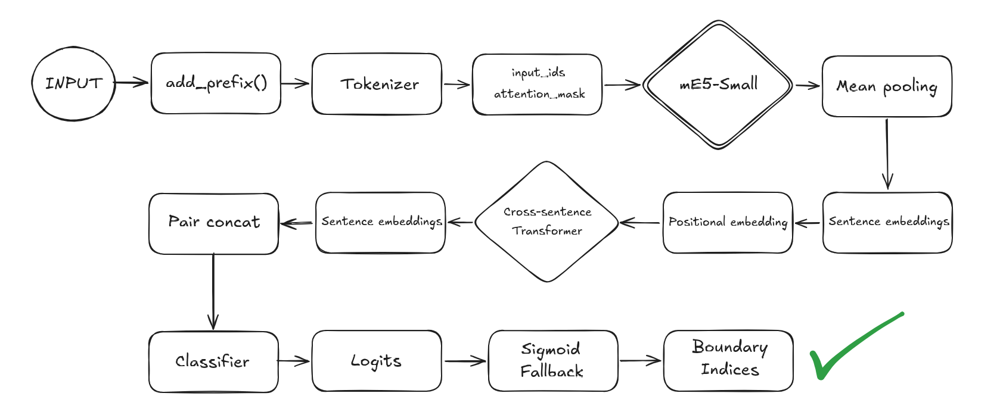

# Seam AI (pytorch tabanlı NLP projem) [Modeli Deneyin](https://pirhasanoglu.com)

**RAG pipeline'ları için anlamsal metin bölümleme modeli.**

Geliştirdiğim bu NLP modeli; RAG için hazırlanan hem İngilizce hem Türkçe dokümanların chunking problemini dokümanı anlamsal bölümlere ayırarak çözen, böylece RAG’dan maximum verim alınmasını sağlayan bir NLP modelidir. Model, cümle bazında konunun değiştiği yeri tespit edebiliyor. Ayrıca RAG işlemine doğrudan girebilecek şekilde embedding uygulanmış JSON formatında çıktı alıyorsunuz.

Mimarisi; mE5-small base encoderin üzerine kendi kurduğum özel bir Cross-Sentence Attention mekanizmalı Transformer bloğundan oluşuyor. Bu sayede klasik bir bi-LSTM yapısına göre çok daha esnek şekilde dokümanı tarayabiliyor, ayrıca max_sents=20 değeri ile Transformerin ilgilendiği kısım sınırlandırılıyor ve bu pencerede anlam kopukluğu aranıyor. Bu hem birden fazla boundary bulmak için yeterli bir pencere büyüklüğü sağlıyor, hem de Transformer mimarisinin ciddi dezavantajı olan O(N²) şeklindeki çılgın time complexity derdine de deva oluyor.


---

## Mimari

```
Ham Metin
    ↓ NLTK cümle bölme
Cümle Dizisi
    ↓ mE5-small Encoder  (cümle içi anlam)
    ↓ Mean Pooling        (384 boyut)
    ↓ Cross-Sentence Attention  (2 katman, 4 head)
    ↓ Komşu çift concat   (768 boyut)
    ↓ Boundary Classifier
Chunk Sınırları
```

**mE5-small** (`intfloat/multilingual-e5-small`) her cümlenin kendi içindeki anlamını encode eder.

**Cross-Sentence Attention** cümleler arası ilişkiyi modelleyen özel bir transfomer bloğudur. her cümle diğer tüm cümleleri görür, sıralı bağımlılık yoktur.

**Boundary Classifier** komşu iki cümle arasında anlamsal geçiş olup olmadığını tahmin eder.

---

## Özellikler

- **Çok dilli** : Türkçe ve İngilizce aynı modelle desteklenir
- **Uzun döküman desteği** : Sliding window inference ile sınırsız uzunlukta metin işler
- **Ayarlanabilir hassasiyet** : `threshold` parametresiyle chunk granülaritesi kontrol edilir
- **Production-ready** : ONNX formatında

---

## Veri

| Kaynak | Dil | Segment |
|---|---|---|
| Wikipedia | EN | ~33K |
| Wikipedia | TR | ~17K |
| OpenWebText | EN | ~2.5K |
| **Toplam** | | **~52K** |

Boundary oranı: **%8.87** 5 paragraflık gruplama ile organik section geçişlerinden üretildi.

---

## Eğitim

| Parametre | Değer |
|---|---|
| Base model | `intfloat/multilingual-e5-small` |
| Encoder LR | 5e-6 |
| Head LR | 2e-5 |
| Batch size | 16 |
| Epochs | 5 |
| Optimizer | AdamW + cosine warmup |
| Loss | BCEWithLogitsLoss (pos_weight: 10.3) |

**Sonuçlar (Epoch 3):**

| Metrik | Değer |
|---|---|
| Val F1 | 0.4941 |
| Precision | 0.4188 |
| Recall | 0.6023 |
| Threshold | 0.70 |

---

## Teknolojiler

`PyTorch` `HuggingFace Transformers` `ONNX Runtime` `Python` `mE5-small`
